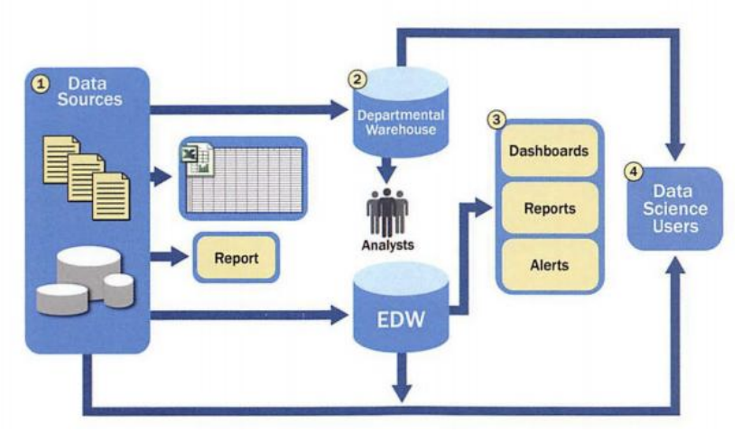
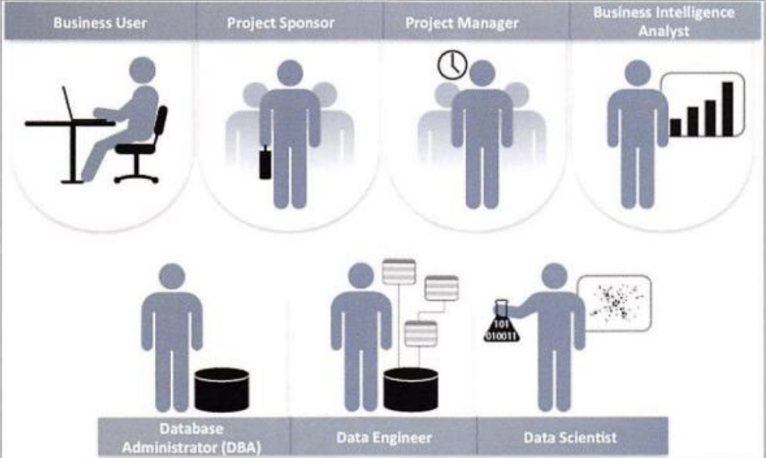
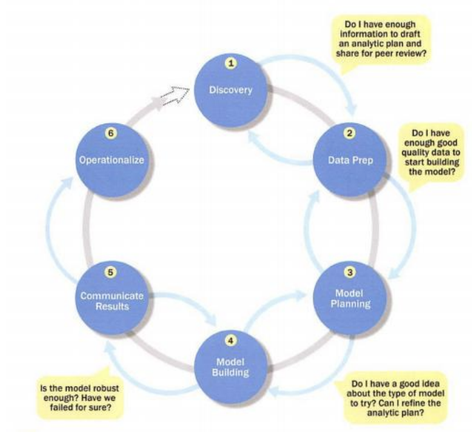

2a. dari kasus diatas, bagaimana penerapan big data dalam layanan transportasi dan logistik 
2b. keuntungan penggunaan big data dalam hal tersebut
2c. apakah tantangan dalam penerapan big data dalam organisasi tersebut

3. dalam pengambilan keputusan berbasis big data, organisasi dapat menggunakan berbagai pendekatan analitik
3a. bandingkan karakteristik dan tujuan dari deskriptif, prediktif, dan preskriptif
3b. berikan contoh bagaimana ketiga diterapkan dalam industri perbankan digital 

4. Jelaskan gambar tersebut (halaman 25)

5. sebutkan berapa jenis data di big data, jelaskan, beri contoh masing masing

6. Perbedaan antara BI dan data science pada proses dan penerapannya dalam big data (Pertemuan 3, halaman 24)

7. kasih penjelasan dan kasih contohnya dari masing masing gambar tersebut (pertemuan 3, halaman 26)
8. Sebuah perusahaan layanan digital ingin meningkatan kinerja bisnis dan penguasaan pengguna dalam big data
a. bagaimana perusahaan dapat menggunakan big data analytic untuk memahami perilaku pengguna
b. identifikasi jenis data yang digunakan dalam kasus tersebut
c. manfaat dan tantangan dalam big data di kasus tersebut

9. jelaskan (pertemuan 6,halaman 6)

10. jelaskan gambar tersebut (pertemuan 6,halaman 14)

# Rangkuman Materi Kisi-kisi Big Data

---

## 1. Jelaskan bagaimana karakteristik veracity dan value menjadi tantangan sekaligus peluang bagi perusahaan teknologi dan mengapa memilki data yang banyak tidak cukup tanpa kedua unsur

---

## 2. 
2a. dari kasus diatas, bagaimana penerapan big data dalam layanan transportasi dan logistik 
2b. keuntungan penggunaan big data dalam hal tersebut
2c. apakah tantangan dalam penerapan big data dalam organisasi tersebut

---

## 3. dalam pengambilan keputusan berbasis big data, organisasi dapat menggunakan berbagai pendekatan analitik
3a. bandingkan karakteristik dan tujuan dari deskriptif, prediktif, dan preskriptif
3b. berikan contoh bagaimana ketiga diterapkan dalam industri perbankan digital 

---

## 4. Jelaskan gambar berikut (halaman 25)

---

## 5. sebutkan berapa jenis data di big data, jelaskan, beri contoh masing masing

---

## 6. Perbedaan antara BI dan data science pada proses dan penerapannya dalam big data (Pertemuan 3, halaman 24)

---

## 7. kasih penjelasan dan kasih contohnya dari masing masing gambar tersebut (pertemuan 3, halaman 26)

---

## 8. Sebuah perusahaan layanan digital ingin meningkatan kinerja bisnis dan penguasaan pengguna dalam big data
a. bagaimana perusahaan dapat menggunakan big data analytic untuk memahami perilaku pengguna
b. identifikasi jenis data yang digunakan dalam kasus tersebut
c. manfaat dan tantangan dalam big data di kasus tersebut

---

## 9. jelaskan (pertemuan 6,halaman 6)

---

## 10. Jelaskan gambar berikut (Pertemuan 6, Halaman 14)
