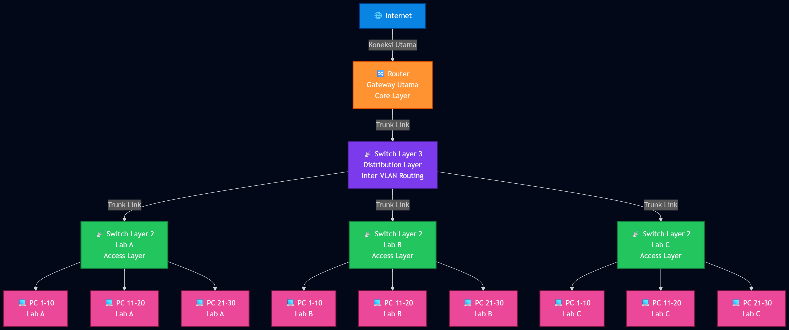

# Rangkuman Kisi Kisi Jaringan Komputer 2

## 1. VTP (VLAN Trunking Protocol)

### Definisi VTP

**VLAN Trunking Protocol (VTP)** adalah protokol yang mengurangi administrasi di dalam switched network dengan memungkinkan administrator jaringan untuk mengelola VLAN secara terpusat.

**Fungsi Utama:**

- Mengelola penambahan, penghapusan, dan penggantian nama VLAN di seluruh domain
- Mendistribusikan dan menyinkronkan informasi VLAN melalui trunk links
- Mengurangi konfigurasi manual VLAN di setiap switch

### Langkah-Langkah Konfigurasi VTP Dasar

**Langkah 1: Mengonfigurasi VTP Server**

```
S1> enable
S1# configure terminal
S1(config)# vtp mode server
```

**Langkah 2: Mengonfigurasi Domain & Password**

```
S1(config)# vtp domain CCNA
S1(config)# vtp password cisco12345
```

**Langkah 3: Membuat VLAN pada Server**

```
S1(config)# vlan 10
S1(config-vlan)# name SALES
S1(config-vlan)# exit
```

**Langkah 4: Mengonfigurasi VTP Client**

```
S2> enable
S2# configure terminal
S2(config)# vtp mode client
S2(config)# vtp domain CCNA
S2(config)# vtp password cisco12345
S2(config)# exit
```

## 2. Case Study Perusahaan - Analisa VTP

### Skenario Perusahaan

Sebuah perusahaan besar memiliki gedung 5 lantai dengan ratusan karyawan yang dibagi menjadi beberapa departemen: **HRD, Finance, IT, dan Operasional**. Perusahaan membutuhkan manajemen jaringan yang terpusat agar tidak perlu mengonfigurasi VLAN secara manual di setiap switch.

### Mode VTP Server - Di Data Center IT

**Penempatan:** Switch Core atau Switch Distribution di ruang Data Center IT

**Fungsi:**

- Memusatkan pembuatan, modifikasi, dan penghapusan VLAN
- Membuat VLAN untuk setiap departemen (VLAN HRD, VLAN Finance, dll)
- Mendistribusikan perubahan otomatis ke seluruh jaringan

**Alasan:** Administrator hanya perlu mengkonfigurasi satu perangkat pusat, dan semua switch lain akan menerima update VLAN secara otomatis.

### Mode VTP Client - Di Setiap Lantai Gedung

**Penempatan:** Switch Access di setiap lantai gedung

**Fungsi:**

- Menerima database VLAN dari VTP Server
- Menerapkan VLAN ke port komputer karyawan
- Mencegah modifikasi VLAN lokal

**Alasan:** Mode ini mencegah teknisi lokal atau pihak tak berwenang membuat atau menghapus VLAN secara tidak sengaja di lantai tersebut.

### Mode VTP Transparent - Di Ruang R&D

**Penempatan:** Switch khusus di ruang Research and Development (R&D)

**Fungsi:**

- Membuat Extended VLAN yang bersifat lokal (misalnya Extended VLAN 2000)
- Meneruskan update VTP dari pusat ke switch lain
- Menjaga isolasi jaringan R&D

**Alasan:** Ruang R&D membutuhkan jaringan terisolasi, sehingga VLAN khusus tidak boleh tersebar ke gedung lain. Mode transparent tetap meneruskan update VTP, tetapi tidak mengubah database VLAN-nya sendiri, sehingga privasi terjaga.

## 3. Routing

### Dukungan Protokol Routing

**Kompatibilitas:** Semua switch Layer 3 Cisco Catalyst mendukung routing protocols, tetapi beberapa model memerlukan **enhanced software** (perangkat lunak yang ditingkatkan) untuk fitur routing protocol tertentu.

### Inter-VLAN Routing dengan SVI (Switch Virtual Interfaces)

**Definisi:** Layer 3 switching yang menggunakan Switch Virtual Interfaces adalah metode inter-VLAN routing yang dapat dikonfigurasi pada switch Catalyst 2960.

**Fungsi SVI:**

- Menyediakan gateway bagi sebuah VLAN
- Memungkinkan traffic dirutekan masuk atau keluar dari VLAN
- Menyediakan konektivitas Layer 3 IP ke switch

**Keuntungan:** SVI memproses routing lebih cepat dibanding router tradisional karena berada dalam hardware switch.

### Layer 3 Interfaces (Routed Ports)

**Definisi:** Routed port adalah antarmuka Layer 3 pada switch.

**Penempatan:** Routed ports biasanya diimplementasikan di antara lapisan Distribution dan Core untuk menghubungkan switch layer 3 dengan router atau switch layer 3 lainnya.

**Fungsi:** Memungkinkan routing langsung antar kelompok jaringan tanpa perlu Virtual Interface.

## 4. Case Study Universitas - Desain Jaringan Lab

### Skenario Universitas

Desain jaringan untuk 3 Laboratorium Komputer yang menggunakan model **Hierarki 3 Lapisan** (Core, Distribution, Access).

### Komponen Perangkat yang Dibutuhkan

**Core Layer:**

- **1 Unit Router** - Berfungsi sebagai gateway utama yang menghubungkan seluruh jaringan universitas ke Internet

**Distribution Layer:**

- **1 Unit Switch Layer 3** - Berfungsi sebagai jembatan antara Router dan Lab, menangani Inter-VLAN Routing antar laboratorium agar beban routing tidak menumpuk di Router utama

**Access Layer:**

- **3 Unit Switch Layer 2** - Dialokasikan 1 switch untuk masing-masing Lab (Lab A, Lab B, Lab C)

**End Devices:**

- **90 Unit PC** - Dialokasikan 30 PC untuk masing-masing Lab yang terhubung langsung ke Switch Access di ruangan tersebut

### Topologi Fisik



### Keandalan Jaringan (Reliability)

**Alasan Keandalan Tinggi:**

1. **Isolasi Gangguan (Fault Isolation)**
   - Jika Switch Lab A mengalami kerusakan atau mati listrik, Lab B dan Lab C tetap dapat beroperasi normal dan mengakses internet

2. **Performa Optimal**
   - Switch Layer 3 mempercepat pertukaran data antar-VLAN (misalnya saat sharing file antar lab)
   - Tidak membebani Router utama dengan routing traffic lokal
   - Jaringan tidak mudah lambat atau down

## 5. VTP dalam Skala Jaringan Besar - Konfigurasi Multi-Mode

### Skenario Implementasi

Dalam jaringan skala besar dengan puluhan switch, diperlukan kombinasi mode VTP untuk fungsionalitas optimal. Skenario ini mengkonfigurasi:

- Satu Switch Distribution sebagai **VTP Server** (pusat manajemen)
- Satu Switch di lokasi terpencil sebagai **VTP Transparent** (untuk Extended VLAN terisolasi)
- Satu Switch Access sebagai **VTP Client** (penerima konfigurasi)

### Konfigurasi VTP Server Utama

**Perangkat:** Switch Distribution di pusat data

```
Switch> enable
Switch# configure terminal
Switch(config)# vtp version 2
Switch(config)# vtp mode server
Switch(config)# vtp domain KAMPUS_BESAR
Switch(config)# vtp password jaringan123

Switch(config)# vlan 10
Switch(config-vlan)# name DOSEN
Switch(config-vlan)# exit

Switch(config)# vlan 20
Switch(config-vlan)# name MAHASISWA
Switch(config-vlan)# exit
```

### Konfigurasi VTP Transparent - Cabang Khusus

**Perangkat:** Switch di lokasi terpencil/isolated

```
Switch> enable
Switch# configure terminal
Switch(config)# vtp version 2
Switch(config)# vtp mode transparent
Switch(config)# vtp domain KAMPUS_BESAR
Switch(config)# vtp password jaringan123

Switch(config)# vlan 2000
Switch(config-vlan)# name CCTV_TERSEMBUNYI
Switch(config-vlan)# exit
```

### Konfigurasi VTP Client - Gedung Mahasiswa

**Perangkat:** Switch Access di lokasi satelit

```
Switch> enable
Switch# configure terminal
Switch(config)# vtp version 2
Switch(config)# vtp mode client
Switch(config)# vtp domain KAMPUS_BESAR
Switch(config)# vtp password jaringan123
Switch(config)# exit

Switch# show vlan brief
```

**Verifikasi:** Perintah `show vlan brief` memastikan Switch Client sudah menerima VLAN DOSEN (10) dan MAHASISWA (20) dari Switch Server.

---

**Catatan:** Konfigurasi di atas adalah Command untuk Cisco Packet Tracer
